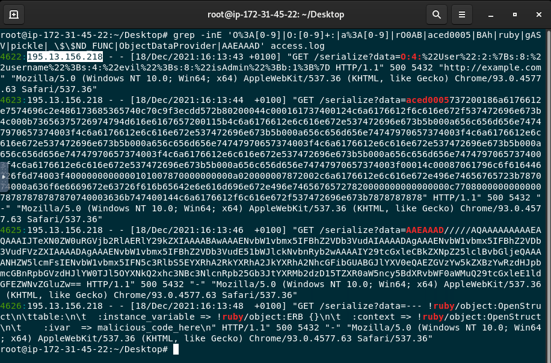
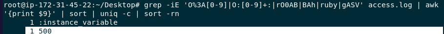
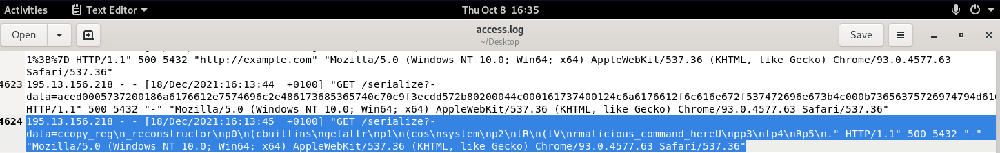
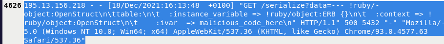

# Section 10: Detecting Insecure Deserialization Vulnerabilities

> Part of my **Web Attack Detection and Analysis** course notes. See the [README](README.md) for all sections.

## Overview

This section covers **insecure deserialization**. What happens when an application deserializes attacker-controlled data without validation, which can lead to **remote code execution**, privilege escalation, data tampering and DoS. It covers how it works across PHP, Python, Java, .NET and Ruby, the byte/string **signatures** that give each one away in logs, and how a SOC detects it.

| # | Topic |
|---|-------|
| 1 | Serialization and insecure deserialization |
| 2 | How insecure deserialization works |
| 3 | Prevention and "am I vulnerable?" |
| 4 | Language-specific indicators (PHP, Python, Java, .NET, Ruby) |
| 5 | SOC detection approach |
| 6 | Common attacks by language, with payloads |

---

## 1. Serialization and insecure deserialization

- **Serialization** = turning an in-memory object into a storable/transmittable format (a byte stream, or text like JSON/XML).
- **Deserialization** = the reverse, rebuilding the object from that data.

These are everywhere: saving sessions, caching, passing objects over a network, cross-language data exchange.

**Insecure deserialization** is when an application **blindly deserializes data from an untrusted source** without validation. Because some formats can reconstruct *arbitrary objects* (and run code as part of rebuilding them), a crafted blob can be turned into **code execution**, the attacker never needed valid credentials, just an input that gets deserialized.

---

## 2. How the attack works

### Code execution (Python `pickle`)
Python's `pickle` lets a class define `__reduce__`, which tells it how to rebuild the objectand that can be *"call this function with these args."* An attacker abuses it:
```python
import pickle, os
class Malicious:
    def __reduce__(self):
        return (os.system, ("echo Insecure Deserialization Exploited!",))

payload = pickle.dumps(Malicious())
pickle.loads(payload)   # runs os.system(...) on load → RCE
```
Any endpoint that does `pickle.loads()` on user input is exploitable.

### Data tampering / privilege escalation (PHP object)
Even without code execution, tampering with a serialized object can break access control. A PHP "super cookie":
```
# Regular user
a:4:{i:0;i:132;i:1;s:7:"Mallory";i:2;s:4:"user"; i:3;s:32:"b6a8...c960";}
# Attacker edits role → admin
a:4:{i:0;i:1;i:1;s:5:"Alice";i:2;s:5:"admin"; i:3;s:32:"b6a8...c960";}
```
If the app trusts the deserialized cookie, the attacker is now **admin**.

---

## 3. Prevention and "am I vulnerable?"

**You're at risk if** the app deserializes hostile objects, enabling either **object/RCE attacks** (classes that change behavior on deserialization) or **data-tampering / access-control attacks** (editing serialized state).

**Prevent it by:**
- **Don't deserialize untrusted data**, prefer safe formats (JSON/XML) over `pickle`, Java `Serializable`, etc.
- **Validate and sanitize** anything you must deserialize.
- **Whitelist allowed classes** (and blacklist dangerous ones).
- Use **secure/maintained serialization libraries**, enforce **access controls**, and **patch** dependencies.
- **Log and monitor** deserialization activity; put a **WAF** in front.

---

## 4. Language-specific indicators (how it shows up)

These are the fingerprints that make deserialization payloads detectable in logs:

| Language | Risky functions / libraries | Signature to grep for |
|---|---|---|
| **PHP** | `unserialize()` | `O:<n>:"…"` (object), `a:<n>:{…}` (array) |
| **Python** | `pickle` / `cPickle` `load`/`loads`, `PyYAML.load`, `jsonpickle` | stream often **ends with `.`**; `cos\nsystem`, `__reduce__` |
| **Java** | `ObjectInputStream.readObject`, `XMLDecoder`, `XStream.fromXML` | hex **`AC ED 00 05`**, base64 **`rO0`**, `Content-Type: application/x-java-serialized-object` |
| **.NET** | `BinaryFormatter`, `TypeNameHandling`, `JavaScriptTypeResolver`, `ObjectDataProvider` | base64 **`AAEAAAD`** |
| **Ruby** | YAML (`Psych`/`Syck`), `Marshal` | `!ruby/object:`, Marshal base64 **`BAh`** |

---

## 5. Detecting insecure deserialization (SOC approach)

The course lays out the usual SOC workflow, **log monitoring, SIEM rules, anomaly detection** (e.g. unusually large payloads), **input validation**, access controls, security testing, and custom **signatures**. Two concrete techniques:

### Signature / pattern matching
Grep the access log for the per-language fingerprints above (this is the kind of combined signature used in the lab):
```bash
grep -inE 'O%3A[0-9]|O:[0-9]+:|a%3A[0-9]|r00AB|aced0005|BAh|ruby|gASV|pickle|ObjectDataProvider|AAEAAAD' access.log
```
Then pull the status codes or source IPs to triage:
```bash
grep -iE 'O:[0-9]+:|aced0005|AAEAAAD|rO0|BAh|ruby|pickle' access.log | awk '{print $9}' | sort | uniq -c | sort -rn   # status codes
grep -iE 'O:[0-9]+:|aced0005|AAEAAAD|rO0|BAh|ruby|pickle' access.log | awk '{print $1}' | sort | uniq -c | sort -rn   # source IPs
```

### Exception-based detection (Java)
Deserializing tampered data often throws tell-tale exceptions, **`ClassNotFoundException`**, **`InvalidClassException`**, **`ClassCastException`**, or errors inside custom `readObject`. Log these (Log4j/SLF4J → ELK/SIEM), alert on thresholds, and **correlate with suspicious HTTP requests**.

> A WAF/log match proves an **attempt**. Confirm impact with application exceptions, process/endpoint activity and the response behaviour.

---

## 6. Common attacks by language (example payloads)

| Attack | Example payload (abridged) |
|---|---|
| **PHP object injection** | `O:4:"User":2:{s:8:"username";s:4:"evil";s:8:"isAdmin";b:1;}` → forges an admin `User` |
| **Java** | base64 starting `rO0AB…` (hex `AC ED 00 05`) → gadget-chain RCE |
| **Python pickle** | `c__builtin__\nos.system…` / `__reduce__` → runs `os.system("…")` |
| **.NET BinaryFormatter** | base64 starting `AAEAAAD/////…` → RCE on deserialize |
| **Ruby YAML** | `--- !ruby/object:OpenStruct …` → RCE via crafted object |

---

## 7. Lab: Insecure Deserialization log analysis

**Environment:** a Linux VM with one nginx `access.log` on the Desktop. The attacker fired serialized payloads in several languages (PHP, Java, Python, .NET, Ruby) at a `/serialize?data=…` endpoint, all from one IP within a few seconds.

**Tasks**

- What is the **attacker's IP address**?



- What is the **common HTTP response code** associated with the attacks?



- Which entry contains a payload that attempts to **execute a system command**? (date/time)



- Which entry used a **Ruby object** for the attempt? (date/time)



- Which **request parameter** is most commonly targeted?

**Data**

**Answers**

| Question | Answer |
|---|---|
| Attacker IP | `195.13.156.218` |
| Common response code | `500` |
| System-command payload | `18/Dec/2021:16:13:45` (Python `pickle` → `os.system`) |
| Ruby object attempt | `18/Dec/2021:16:13:48` |
| Most-targeted parameter | `data` |

**How I approached it**
- Ran the combined signature grep (section 5) to surface every serialized payload across the five languages.
- All matches came from **one IP** and carried the payload in the **`data`** parameter → attacker IP and target parameter.
- Checked the status column (`awk '{print $9}'`): every attack returned **`500`** → the common response code.
- Decoded each payload to attribute it: the **Python pickle** line (`cos\nsystem … echo …`) is the **system-command** attempt (16:13:45); the **`!ruby/object:OpenStruct`** line is the **Ruby** attempt (16:13:48).

**Observations**
- A `500` on every attempt means the server **errored while deserializing**, that pattern (serialized blob in → server error) is itself a strong detection signal, even without confirming code ran.
- The attacker **sprayed one payload per language** back-to-back (PHP `O:4:"User"…`, Java `aced0005…`, Python pickle, .NET `AAEAAAD…`, Ruby YAML) classic automated probing to see which runtime the app uses.

---

## Key takeaways

- Insecure deserialization = **deserializing untrusted data** → RCE, privilege escalation, data tampering. Python `pickle`, Java `Serializable`, PHP `unserialize`, .NET `BinaryFormatter` and Ruby YAML are the usual culprits.
- Each language leaves a **signature**, PHP `O:`/`a:`, Java `AC ED 00 05` / `rO0`, Python streams ending `.`, .NET `AAEAAAD`, Ruby `!ruby/object:` / `BAh` which is what detection grep/SIEM rules key on.
- Detection also leans on **deserialization exceptions** (`ClassNotFoundException`, `InvalidClassException`, `ClassCastException`) and **anomalies** like oversized payloads; a flood of **`500`s on serialized input** is a giveaway.
- Fix it by **not deserializing untrusted data**, using **safe formats**, **class allowlisting**, and patching.
- Verify CVE attributions: the course's Struts2 (CVE-2017-5638) and MS15-004 examples are **not** deserialization bugs — the real references are **Commons Collections / ysoserial** (Java) and **BinaryFormatter / ysoserial.net** (.NET).

## Skills practised

Understanding serialization/deserialization and the RCE path through it, recognizing per-language serialized payloads and their byte/string signatures, building signature-based grep/SIEM detection, using exceptions and anomalies as detection signals, reconstructing an attack timeline from logs, and verifying real-world CVE attributions.

---

*Previous: [Section 9: SAML Vulnerabilities and Detection](09-saml-vulnerabilities-and-detection.md) | Next: [Section 11: Detecting Spring4Shell Attack](https://github.com/YusraAlMazrui/Web-Attacks-Detection-And-Analysis/blob/f3a9b40347b54f3bc7a7288a8a1cde7c28153f4f/11-detecting-spring4shell-attack.md)*
