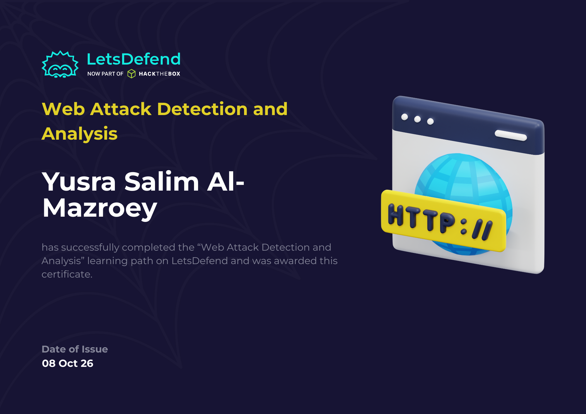

# Web Attack Detection and Analysis: Let's Defend Course 

My notes and lab write-ups from the Web Attack Detection and Analysis course. The focus is on the defender's side: recognizing web attacks in logs and HTTP requests, judging whether they succeeded, and knowing how to prevent them, from classic web vulnerabilities through high-profile CVEs (Log4Shell, Text4Shell, Spring4Shell, F5 BIG-IP) and attacks on authentication (JWT, SAML) and serialization.

## Certificate

 

## Contents

| Section | Topics |
|---------|--------|
| [1. Detecting Web Attacks](01-detecting-web-attacks.md) | SQL Injection, XSS, Command Injection, IDOR, LFI & RFI | 
| [2. Detecting Web Attacks - 2](02-detecting-web-attacks-2.md) | Open Redirection, Directory Traversal, Brute Force, XXE | 
| [3. Detecting Advanced Web Attacks](03-detecting-advanced-web-attacks.md) | SSTI, Expression Language Injection, HTTP Header Injection, SSRF, NoSQL Injection | 
| [4. Hacked Web Server Analysis](04-hacked-web-server-analysis.md) | Log analysis, Web Server and Application Attacks, Web Shells, WordPress Compromise |
| [5. Detecting Log4Shell Attack](05-detecting-log4shell-attack.md) | Log4Shell (CVE-2021-44228), Payload Obfuscation, Detection Rules, Mitigation |
| [6. Detecting Text4Shell Attack](06-detecting-text4shell-attack.md) | Text4Shell, Attack Vectors, How to Exploit, Detection and Mitigation, Soc Analysts | 
| [7. F5 BIG-IP iControl REST RCE Detection](07-detecting-f5-icontrol-rest-rce.md) | CVE-2022-1388, iControl REST Auth Bypass, /mgmt/tm/util/bash RCE, Detection & Mitigation |
| [8. JWT Attacks and Detection](08-jwt-attacks-and-detection.md) | JSON Web Tokens, kid (Key ID) Injection, SQLi / RCE / Directory Traversal, Detection & Mitigation |
| [9. SAML Vulnerabilities and Detection](09-saml-vulnerabilities-and-detection.md) | SAML / SSO (IdP, SP), XXE, XSLT Injection, Signature Wrapping (XSW), SSRF, Regex Detection |
| [10. Detecting Insecure Deserialization](10-detecting-insecure-deserialization.md) | Serialization RCE across PHP / Python / Java / .NET / Ruby, Signatures, SOC Detection |
| [11. Detecting Spring4Shell Attack](11-detecting-spring4shell-attack.md) | Spring4Shell (CVE-2022-22965), classLoader Data-Binding RCE, Tomcat JSP Web Shell, Detection & Mitigation |

## SOC Alerts

| Alert | Type | Verdict |
|-------|------|---------|
| [SOC170 - Passwd Found in Requested URL](SOC-Alerts-Challenges/soc170-possible-LFI-attack.md) | Web Attack (LFI) | True Positive |
| [SOC169 - Possible IDOR Attack](SOC-Alerts-Challenges/soc169-possible-idor-attack.md) | Web Attack (IDOR) | True Positive |

## Approach used across the labs

Each lab gave a log file to investigate. The recurring questions were:

1. When did the exploitation phase start?
2. Which IP did the attack come from?
3. Which parameter or file was targeted?
4. Was it automated, and what type of attack was it?
5. Was it successful?

## Skills

Log analysis, attack classification, attacker attribution, timeline reconstruction, payload decoding and deobfuscation, regex-based and signature-based detection, SIEM detection logic, CVE analysis, attempt-vs-success assessment, and vulnerability mitigation planning.

## Note

Labs were done in a provided training environment against intentionally vulnerable targets and sample logs. These notes are for learning and defensive purposes only.
