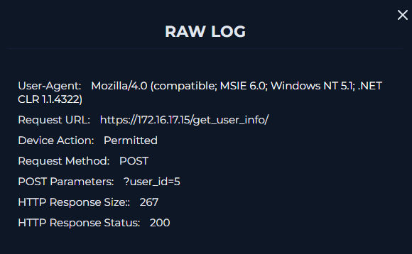

# SOC Alert: SOC169 - Possible IDOR Attack Detected (EventID 119)

> Platform: **LetsDefend** (practice alert, SOC analyst role). Related notes: [IDOR in Section 1](../01-detecting-web-attacks.md#4-insecure-direct-object-reference-idor) | [Back to README](../README.md)

## Summary

| | |
|---|---|
| Alert | SOC169 - Possible IDOR Attack Detected |
| EventID | 119 |
| Date / time | 2022-02-28, 10:48 PM (22:48:05 +03:00) |
| Severity / difficulty | Medium / Medium |
| MITRE ATT&CK | T1190 (Exploit Public-Facing Application) |
| Source IP | 134.209.118.137 (external, DigitalOcean) |
| Target | WebServer1005 (172.16.17.15) |
| Request | `POST https://172.16.17.15/get_user_info/` with `user_id` parameter |
| Alert trigger | Consecutive requests to the same page |
| Device action | Allowed (not blocked) |
| **Verdict** | **True positive, attack likely successful, device contained and escalated to Tier 2** |

---

## 1. Review the alert

The alert details already give the key facts:

- **What fired it:** *consecutive requests to the same page*, `https://172.16.17.15/get_user_info/`.
- **Who:** source IP `134.209.118.137`; **target:** `172.16.17.15` (WebServer1005).
- **How:** HTTP **POST**, and the firewall **allowed** it.
- The User-Agent is an old browser string (`MSIE 6.0; Windows NT 5.1`), unusual for real users today.

## 2. Create the case and start the playbook

I created a case (ticket) for **SOC169 - Possible IDOR Attack Detected** and started the playbook. A case lets the SOC track and prioritize the incident, and a playbook keeps the response consistent from analyst to analyst.

## 3. Is the traffic from inside or outside the network?

The source IP is **external** (outside the company network), so the direction of traffic is **Internet to Company Network**.

## 4. Check the IP reputation

I checked `134.209.118.137` on **VirusTotal** and **AbuseIPDB**. Neither flagged it as malicious, and it belongs to **DigitalOcean**, a cloud hosting provider. A clean reputation doesn't clear it, because cloud IPs are easy to rent and rotate. The traffic itself had to be judged.

<!--

-->

## 5. Examine the traffic

In **Log Management** I filtered by the **source IP**. The query returned **5 events**.

Looking at the requests:

- The attacker sent **multiple requests with different `user_id` values** to the same page.
- Many requests came from one IP in a short time, the same pattern described in my [IDOR notes](../01-detecting-web-attacks/README.md#4-insecure-direct-object-reference-idor): the attacker changes an identifier to reach other users' data.
- **No other traffic** from this IP was seen in the network.

The raw log of a request shows:

| Field | Value |
|---|---|
| Request method | POST |
| Request URL | `https://172.16.17.15/get_user_info/` |
| POST parameters | `user_id=5` |
| Device action | Permitted |
| HTTP response size | 267 |
| HTTP response status | 200 |

Note that this raw log **includes the POST parameters**. Plain web server access logs usually don't (see [Section 4](../04-hacked-web-server-analysis/README.md)), so this is a useful source for judging POST-based attacks.

<!--

-->

## 6. Malicious or not?

**Malicious.** A normal user requests their own record. A single external IP sending consecutive requests with changing `user_id` values is **enumerating other users' data**, which no legitimate user needs to do.

## 7. Attack type

**IDOR** (Insecure Direct Object Reference).

## 8. Planned test?

I checked whether this could be an authorized test, including the **Email Security** tab. There was **no information** about planned work, so it was **not a planned test**.

## 9. Was the attack successful?

**Yes (likely).** The requests returned **HTTP 200** and the **response size differed per `user_id`**, which suggests different users' data was returned.

> **Note on confidence:** a `200` with varying response sizes is strong evidence but not absolute proof. To confirm, an analyst would also check what the responses actually contained (whether the IDs belong to other accounts) and look in the application's own logs. Here, the possibility of data exposure was enough to act.

## 10. Containment and escalation

- Because the attack may have succeeded, I **contained the device** (WebServer1005) to prevent further damage.
- The playbook says to **escalate to Tier 2** when an attack succeeds, so I did.

<!--

-->

## 11. Analyst note

> The alert occurred on February 28, 2022 at 10:48 PM and involved an IDOR request to `https://172.16.17.15/get_user_info/`. The victim server was `172.16.17.15`, while the source IP `134.209.118.137` was identified as the threat actor and belongs to DigitalOcean. VirusTotal and AbuseIPDB did not flag the IP as malicious. Network logs showed multiple requests using different `user_id` values with successful `200` responses, indicating the attacker was attempting to access information belonging to different users. The alert was classified as a True Positive and should be escalated for further investigation.

## 12. Final verdict

**True Positive.**

<!--

-->

---

## What I learned

- **IDOR shows up as a pattern, not a single request.** The alert rule (*consecutive requests to the same page*) caught it, but the proof was the changing `user_id` values.
- **Unlike SOC170, this attack was likely successful.** The success check (status code plus response size) led to **containment and Tier 2 escalation** instead of a simple close.
- **A clean IP reputation is not proof of innocence.** The IP belonged to a cloud provider and wasn't flagged, but the behaviour was clearly malicious.
- Checking the **alert trigger reason** first tells you what behaviour to look for in the logs.
- A good analyst note covers **when, what, who, evidence, and the decision**.

## Skills practised

Alert triage, IP reputation checks, SIEM log filtering by source IP, IDOR pattern recognition, success assessment from response status and size, containment and escalation decisions, case documentation.

---

*Related: [SOC170 - Possible LFI Attack](soc170-possible-LFI-attack.md) | [Back to README](../README.md)*
